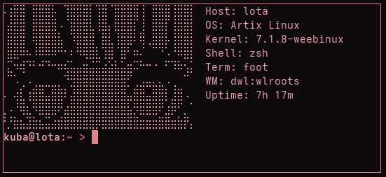

## Justfetch
# c++ suckless system info fetch tool for linux

<b>Install</b> 
<code>https://github.com/taktojakuba/JustFetch.git && cd Jfetch && sudo make install</code> 
<b>Uninstall</b> 
cd Jfetch && sudo make uninstall && cd .. && rm -rf Jfetch 
<b>ussage</b> 
js -- no art 
js /path/to/ascii -- stats with art 
